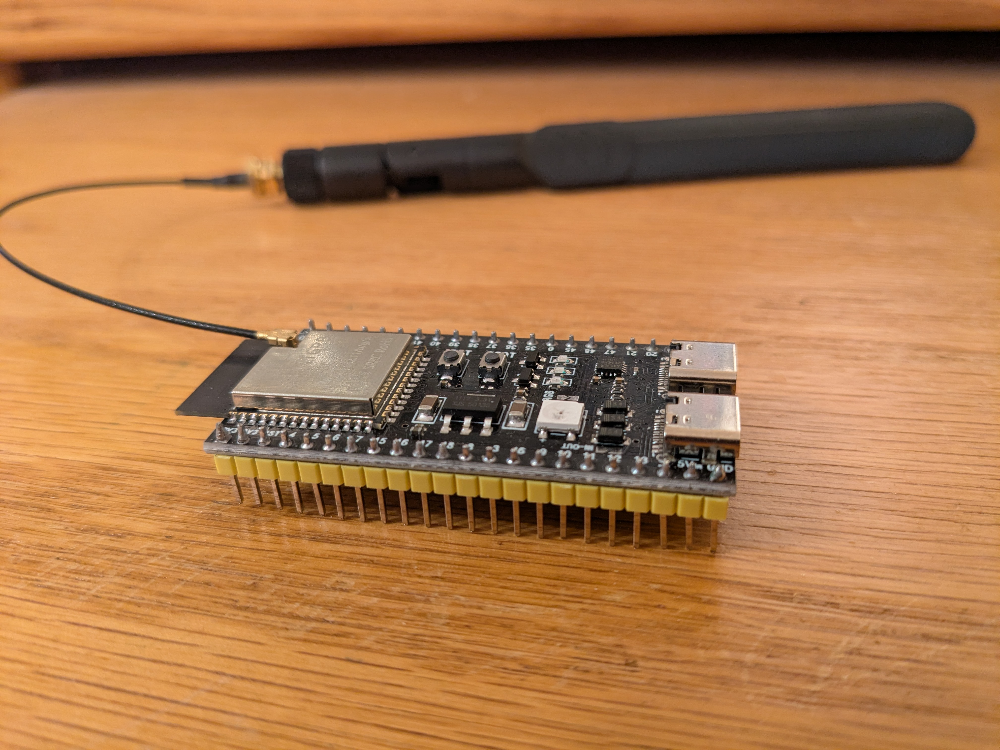
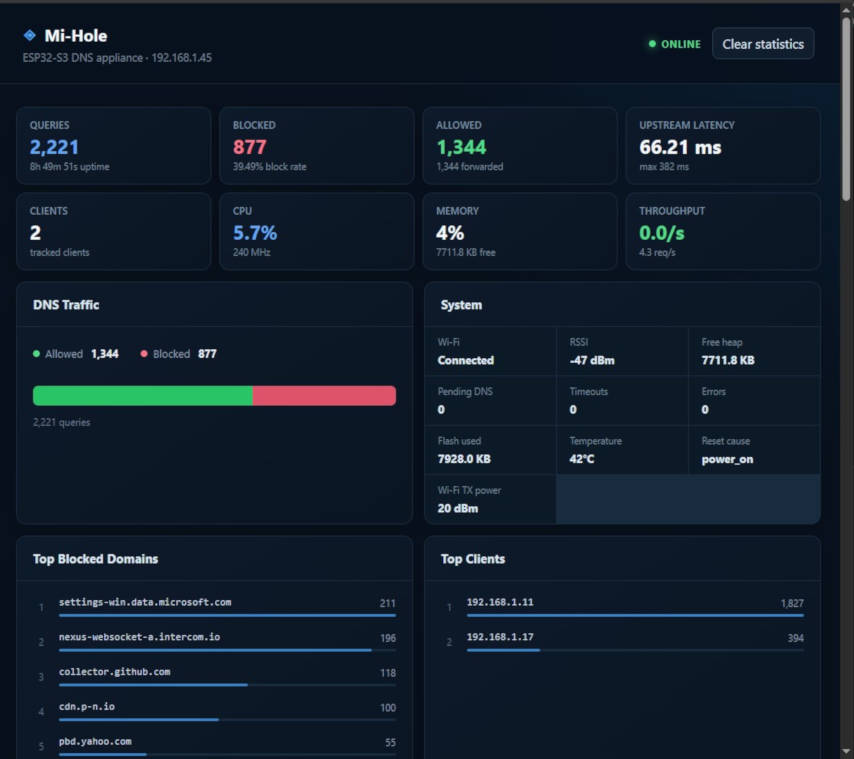
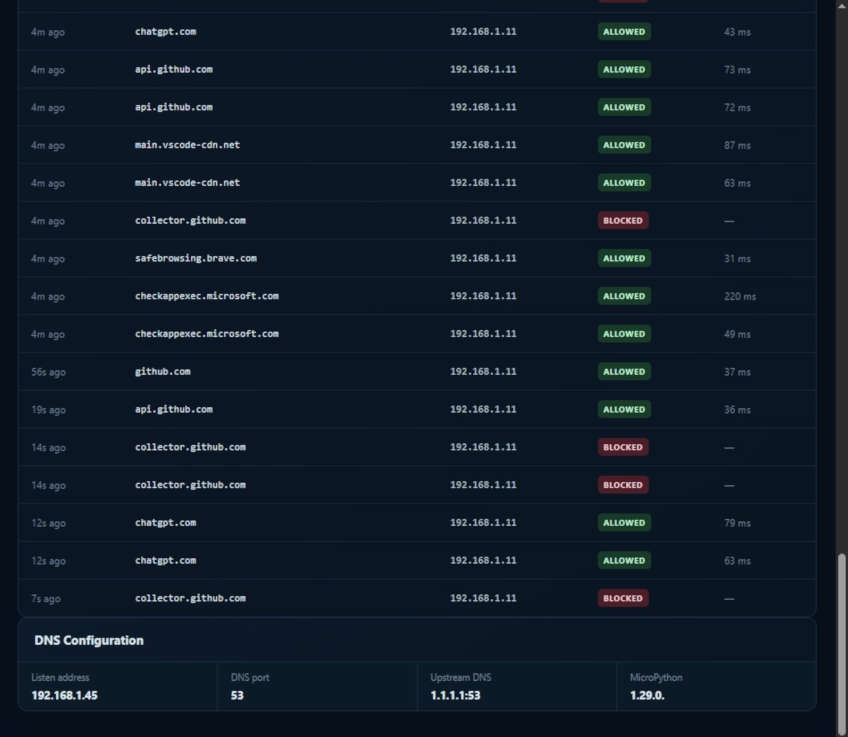

  

<h1 align="center">Mi-Hole</h1>

  ESP32-S3 DNS filtering and monitoring appliance built with MicroPython

<!--
  <a href="">▶ Watch it in action</a> -->
  <a href="https://youtu.be/D5P4xrF4DOM">▶ Watch it in action</a>
  &nbsp;&nbsp;•&nbsp;&nbsp;
  <a href="#screenshots">▶ See the dashboard</a>

# Mi-Hole

**A lightweight DNS filtering and monitoring appliance built on the ESP32-S3 and MicroPython.**

Mi-Hole is a small, self-contained DNS appliance inspired by the general concept behind [Pi-hole](https://pi-hole.net/), but designed for cheap SBC running MicroPython**.

It combines DNS filtering, live statistics, system telemetry, and a browser-based monitoring dashboard into a compact network appliance.

---

## What is Mi-Hole?

Mi-Hole turns an ESP32-S3 into a network DNS appliance.

Once connected to Wi-Fi, the device runs a DNS server that can filter DNS requests while simultaneously exposing a lightweight HTTP/JSON monitoring API. A React/TypeScript dashboard consumes that API and provides a live view of DNS activity and the underlying ESP32-S3.

---

## Screenshots

### Dashboard

### DNS Activity

---

## Architecture

Mi-Hole is composed of three major pieces:

    Web Browser
          |
          | HTTP / JSON API
          v
    +--------------------------------------+
    |              ESP32-S3                |
    |              ESP32-S3                |
    |                                      |
    |  +----------------+  +------------+  |
    |  |   DNS Server   |  |   DNSAPI   |  |
    |  |                |  |            |  |
    |  | DNS filtering  |  | /api/health|  |
    |  | DNS forwarding |  | /api/stats |  |
    |  | Query tracking |  | /api/activity |
    |  | Client tracking|  | /api/domains  |
    |  +-------+--------+  | /api/clients  |
    |          |           | /api/config   |
    |          v           | /api/system   |
    |  +----------------+  | /api/sbc      |
    |  | Client tracking|  | /api/domains  |
    |  +-------+--------+  | /api/clients  |
    |          |           | /api/config   |
    |          v           | /api/system   |
    |  +----------------+  | /api/sbc      |
    |  | Statistics / DB|  | /api/throughput |
    |  +----------------+  | /api/stats/reset |
    |                      +------------+  |
    |                                      |
    |          MicroPython + uasyncio      |
    +--------------------------------------+
          |
          v
       Network / Wi-Fi

The ESP32-S3 handles the DNS workload and telemetry. The dashboard remains a relatively thin client that periodically polls the device's API.

---

## Activity, Hardware, Rankings and Throughput Monitoring
## Activity, Hardware, Rankings and Throughput Monitoring

Because the monitoring API runs directly on the ESP32-S3, the dashboard can expose hardware-level information without requiring a separate monitoring system.

Mi-Hole also tracks request DNS throughput and ranking.

---

## Domain Name Database

To conserve resoures and provide fast response, a DNS "block" database is pre-processed and then copied to the device.  

It is a binary DNS filtering database runtime designed for high-speed DNS name matching on resource-constrained MicroPython environments. It stores DNS labels and domain relationships in a compact binary format and provides fast lookups directly against raw DNS wire-format packets without converting queries into strings. The implementation uses memory-efficient techniques including FNV-1a label hashing, binary-search indexes, a DAFSA-style state transition graph, reusable buffers, bounded caching, and DNS compression-pointer parsing. It supports exact domain matching as well as parent-domain matching (for example, allowing example.com to match www.example.com), while maintaining compatibility between CPython and MicroPython. The database format includes indexed labels, states, and transitions, for low-memory, high-throughput DNS filtering.

See <code>main/dns_database/dns_build.py</code>

The generated database is found in: <code>main/dns_database/dns.db</code>

_dns.db_ is a processed version of https://github.com/hagezi/dns-blocklists#closed_book-multi-ultimate-maximum-protection-most-aggressive-

Note that the blocklist must contain one unembellished name per line before processing with _dns_build.py_, so the hagezi downloaded lists have to be hit with a little _vi_ or equivalent before using _dns_build.py_ to generate the consumable database.

---

## API

The ESP32 exposes a small HTTP/JSON API intended specifically for the dashboard.

| Method | Endpoint | Purpose |
|---|---|---|
| `GET` | `/api/health` | Health check |
| `GET` | `/api/stats` | DNS statistics |
| `GET` | `/api/activity` | Recent DNS activity |
| `GET` | `/api/domains` | Top blocked domains |
| `GET` | `/api/clients` | Top clients |
| `GET` | `/api/config` | DNS configuration |
| `GET` | `/api/system` | Runtime and Wi-Fi information |
| `GET` | `/api/sbc` | Hardware statistics |
| `GET` | `/api/throughput` | DNS/HTTP throughput |
| `POST` | `/api/stats/reset` | Reset DNS statistics |

---

## HTTP API Design

The monitoring API is deliberately implemented without a large web framework.

It uses:

- MicroPython `uasyncio`
- A small HTTP request parser
- JSON responses via `ujson`
- Explicit request and header size limits
- CORS headers
- Connection-per-request HTTP handling
- Lightweight telemetry collection
- `Cache-Control: no-store`, appropriate for live telemetry.
- `Cache-Control: no-store`, appropriate for live telemetry.

---

## Event-Loop Load Monitoring

Mi-Hole estimates event-loop load by measuring scheduling latency.
Mi-Hole estimates event-loop load by measuring scheduling latency.

The monitor repeatedly schedules a short sleep:

    requested delay
          |
          v
    uasyncio.sleep_ms()
          |
          v
    actual elapsed time
          |
          v
    scheduling lateness
          |
          v
    load estimate

When the event loop is lightly loaded, the task generally wakes close to its requested interval. As other work occupies the event loop, the observed scheduling delay increases.

The resulting value should therefore be treated as an **event-loop load estimate**, rather than an exact hardware CPU-utilization measurement.

---

## Dashboard Refresh Rates

The web dashboard uses different polling intervals depending on the type of information.

| Data | Refresh |
|---|---:|
| DNS statistics | ~2 seconds |
| Recent activity | ~1 second |
| Domain/client rankings | ~5 seconds |
| Configuration/system information | ~5 seconds |
| SBC/throughput telemetry | ~2 seconds |

---

## Firmware Startup

The application entry point performs the following sequence:

    Start
      |
      v
    Initialize Wi-Fi
      |
      +-- failure --> RuntimeError
      |
      v
    Create DNS server
      |
      v
    Load DNS database
      |
      v
    Initialize DNS monitoring API
      |
      v
    Start HTTP API
      |
      v
    Run DNS server
      |
      v
    Shutdown / cleanup

The firmware uses `uasyncio` to run the HTTP monitoring API alongside the DNS server.

---

## Hardware

### Target

**ESP32-S3**

The project is designed around running the DNS appliance directly on an ESP32-S3 with Micropython 1.29.

---

## Software Stack

### Firmware

- MicroPython
- `uasyncio`
- ESP32-S3 hardware APIs
- Wi-Fi networking
- DNS server
- JSON/HTTP monitoring API

### Dashboard

- React
- TypeScript
- Browser-based HTTP/JSON polling

The two sides communicate over the local network:

    ESP32-S3
       |
       | HTTP / JSON
       v
    Browser
       |
       v
    React Dashboard

---

## Design Philosophy

Mi-Hole is intentionally small.

- No heavyweight web framework
- No external monitoring daemon
- No database server
- No operating-system dependency
- No requirement for a separate monitoring machine
- Minimal HTTP implementation
- Asynchronous firmware architecture
- Browser-based visualization

The dashboard is primarily a window into what the ESP32 is already doing.

---

## Why an ESP32-S3?

A DNS appliance does not necessarily need a general-purpose computer.

The ESP32-S3 provides:

- Wi-Fi connectivity
- A capable microcontroller
- Sufficient resources for this type of application
- Hardware telemetry
- Low power requirements
- A compact physical footprint
- An inexpensive platform for experimentation

The project is therefore as much an exploration of **how far a microcontroller can be pushed as a practical network appliance** as it is a DNS filtering project.

---

## Current Limitations

This project is intentionally aimed at experimentation, learning, and small-scale deployments.

Potential limitations include:

- MicroPython is not equivalent to a full Linux networking environment.
- The HTTP API is intentionally minimal.
- Event-loop load is an estimate rather than true hardware CPU utilization.
- Telemetry availability can depend on MicroPython firmware and port support.
- Hardware-specific readings such as temperature may not be available on every firmware build.
- The dashboard assumes the ESP32's API is reachable from the browser.
- The monitoring API does not implement authentication.
- CORS is intentionally permissive for local dashboard use.

**Do not expose the management API directly to an untrusted network without adding appropriate access controls.**

---

## Disclaimer

Mi-Hole is an independent experimental project.

It is inspired by the general concept of network-wide DNS filtering and monitoring, but is not a fork of Pi-hole and is not affiliated with or endorsed by the Pi-hole project.

This software is provided for informational and educational purposes. Use of this software does not imply endorsement by the author of any particular use or application. The author assumes no responsibility or liability for any damages or consequences arising from its use.

---

## Copyright

Copyright © 2026 Roger B. Leuthner. All rights reserved.

Unless otherwise specified elsewhere in this repository, the software is provided for informational and educational purposes.

See the repository's license files and individual source-file notices for applicable terms.

---

## Project Status

🚧 **Experimental / hobby project**

Mi-Hole is an exploration of building a useful DNS appliance and monitoring interface on constrained ESP32-S3 hardware using MicroPython.

If you're interested in tiny network appliances, MicroPython, DNS, embedded networking, or squeezing useful telemetry out of microcontrollers, feel free to explore the code.
